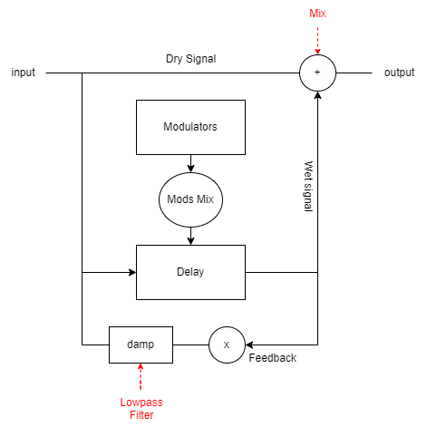

# Analysis of a JUCE Plugin - NEL-19
Analysis of plugin NEL-19 https://github.com/Mrugalla/NEL-19

The aim of the NEL-19 plugin is to develop a vibrato effect based on re-sampling, using a feed-forward delay to modulate the input signal.
The user has the possibility to create several types of vibrato texture by selecting from seven modulators with different functionalities.

# Block Diagram
This plugin adds more useful elements than a simple vibrato. There is a
Feedback, filtered by a Lowpass Filter, that is commonly use in effects
like Flanger and Phaser to determinate the amount of output signal that falls into the circuit.
In addition, the Delay is modulated by a mix (Mods Mix) of different modulators (Modulators), that
the user can select to create different effects.
To create the output signal, there is a mix between dry and wet signals (Mix).

 
# Modulators
There are seven modulators to create different effects.
* Perlin, natural noise to modulate the vibrato.
* Audio-Rate, midi note controlled oscillator.
* Dropout, generates random pitch dropouts.
* Envelope Follower, modulate the vibrato energy.
* Macro, modulates the internal delay.
* Pitchbend, modulates the vibrato.
* LFO, modulates the vibrato with a classic LFO shapes.
 
#Presets
* Broken tape
* Flanger 
* Psychosis 
* Resample 
* Shoe Gaze 
* Sines 
* Thick 
* Dream arp
* Audio rate
* Init
  
# Group: Algorhythmics 
* Alice Sironi
* Cecilia Raho
* Stefano Ravasi
* Yan Zhuang
