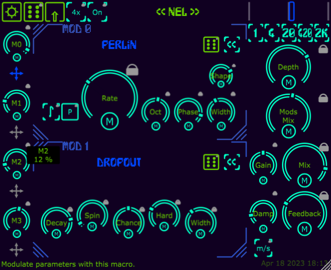

# Analysis of a JUCE Plugin - NEL-19
Analysis of plugin NEL-19 https://github.com/Mrugalla/NEL-19

The aim of the NEL-19 plugin is to develop a vibrato effect based on re-sampling, using a feed-forward delay to modulate the input signal.
The user has the possibility to create several types of vibrato texture by selecting from seven modulators with different functionalities.

# Group: Algorhythmics 
* Alice Sironi
* Cecilia Raho
* Stefano Ravasi
* Yan Zhuang
